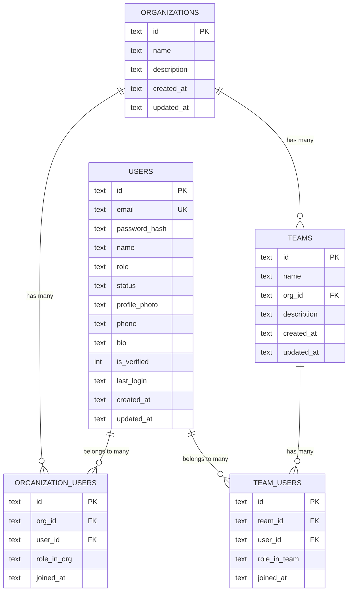

# ER Diagram - Organization & Workspace

## Relationships Explained

### One User → Multiple Organizations ✅
- A user can belong to **multiple organizations** through the `organization_users` junction table
- Each mapping has a `role_in_org` (owner, admin, member)

### One Organization → Multiple Teams ✅
- An organization can have **multiple teams** (one-to-many via `org_id` FK)
- When an organization is deleted, all its teams are automatically deleted (CASCADE)

### One User → Multiple Teams ✅
- A user can belong to **multiple teams** through the `team_users` junction table
- Each mapping has a `role_in_team` (lead, member)

### One Team → One Organization ✅
- Each team belongs to **exactly one organization**

## Scalability Considerations

1. **Multi-tenancy Ready**: Users can work across multiple organizations
2. **Flexible Roles**: Separate role systems for org-level and team-level
3. **Clean Deletion**: CASCADE deletes ensure data integrity
4. **Indexed**: Foreign keys are indexed for fast lookups

## API Endpoints

### Organizations
| Method | Endpoint | Description |
|--------|----------|-------------|
| POST | /api/organizations | Create organization |
| GET | /api/organizations | List all organizations |
| GET | /api/organizations/:id | Get organization by ID |
| PUT | /api/organizations/:id | Update organization |
| DELETE | /api/organizations/:id | Delete organization |
| POST | /api/organizations/:id/users | Add user to organization |
| GET | /api/organizations/:id/users | List users in organization |
| DELETE | /api/organizations/:id/users/:userId | Remove user from organization |

### Teams
| Method | Endpoint | Description |
|--------|----------|-------------|
| POST | /api/teams | Create team |
| GET | /api/teams | List all teams |
| GET | /api/teams/:id | Get team by ID |
| PUT | /api/teams/:id | Update team |
| DELETE | /api/teams/:id | Delete team |
| GET | /api/teams/org/:orgId | Get teams by organization |
| POST | /api/teams/:id/users | Add user to team |
| GET | /api/teams/:id/users | List users in team |
| DELETE | /api/teams/:id/users/:userId | Remove user from team |
